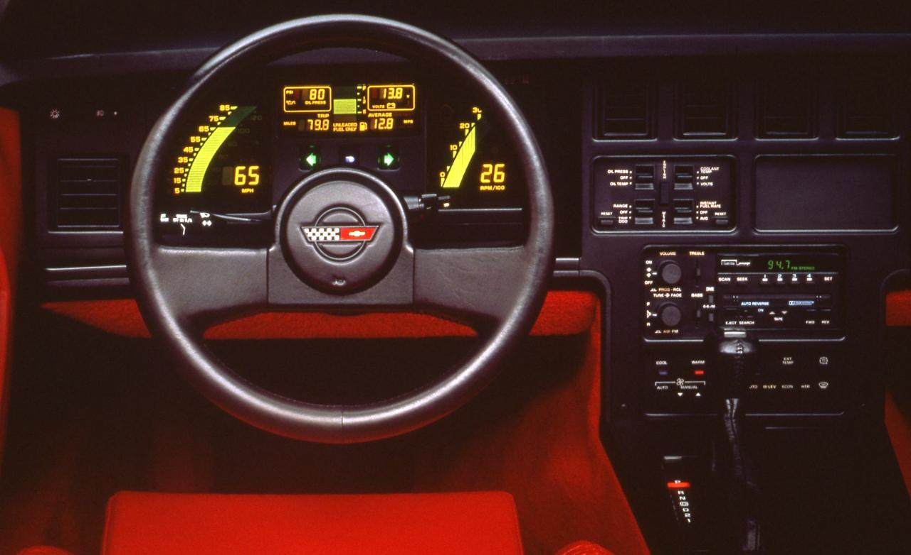
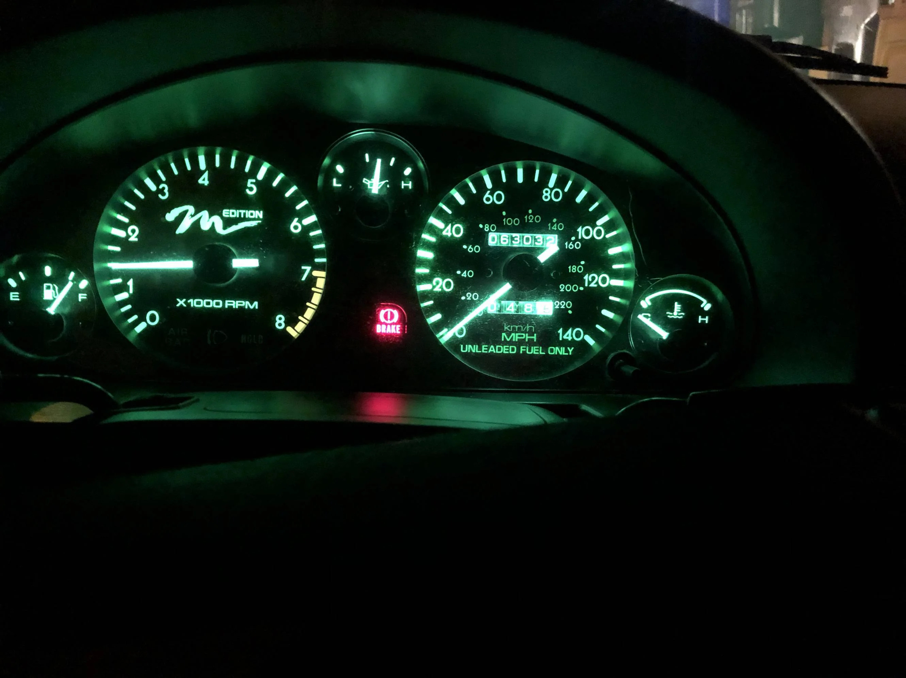
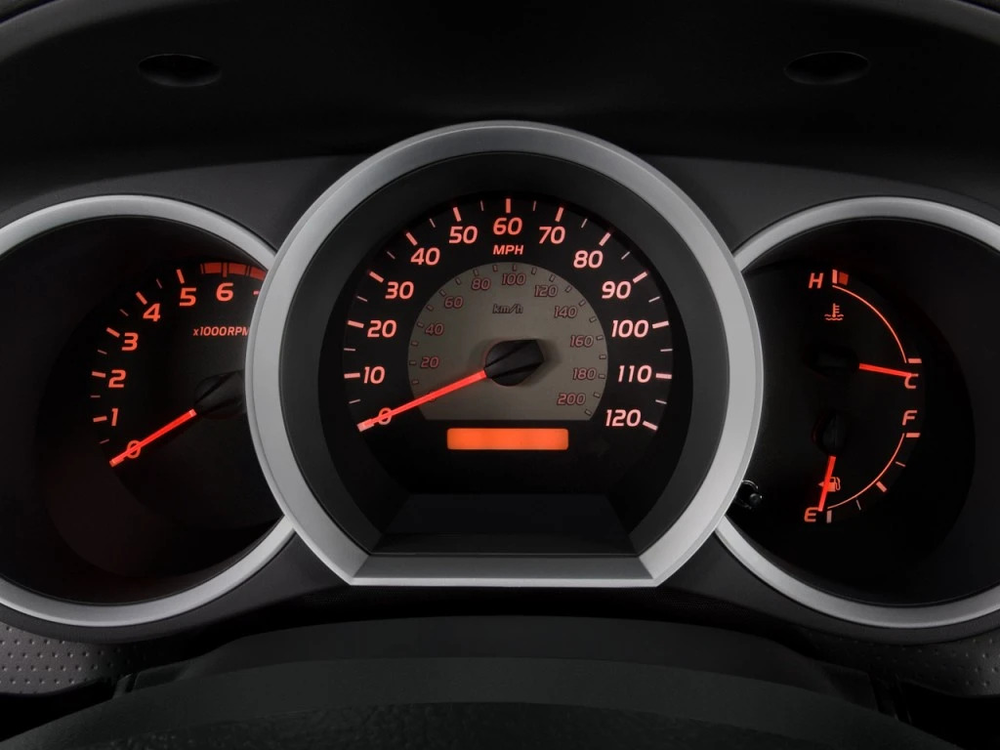
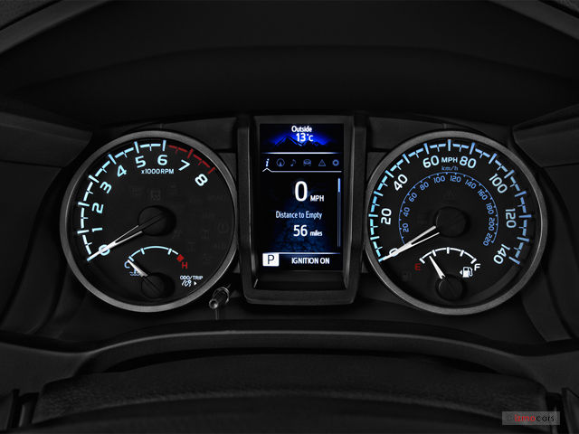
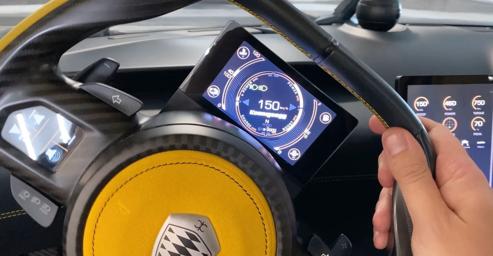
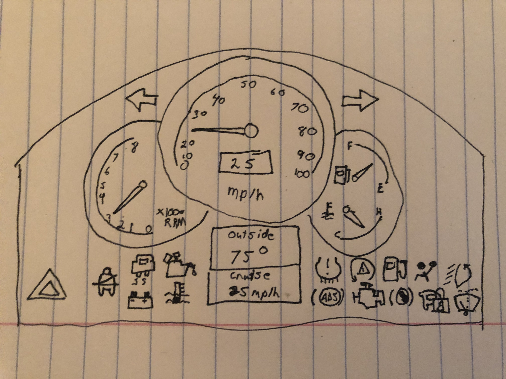

# Tyler Johnson - CS 5331 - Project 2

[Github Page](https://tylermackj.github.io/p2TylerJohnson/)

[Youtube Presentation](https://youtu.be/F4l4NsoXIBs)

## 5 Designs

For the 5 designs I chose a variety from some older cars to brand new hypercars. I did this to see a variety of ideas and price points. I will go through them from oldest to newest.

### 1990s C4 Corvette

The C4 Corvetter has the most intresting dashboard from the 5 as it is styled retro futuristic. On the left and the right are the speedometer and tachometer with bars that fill with light and the value written in big letters. In the middle you can see additional information such as oil pressure, battery voltage, trip distance, average MPG, fuel level and engine temperature. Below that has the turning blinkers and high beams light. 

Overall, this design is quite different but very understandable. The yellow lighting is clear to read and all values are clearly visible. It also includes information like the oil pressure and battery voltage which can be useful that many other cars do not display.

### 2000s Mazda Miata

The early 2000s Mazda Miata went for a more traditional style with analog dials for fuel level, tachometer, oil pressure, speedometer, and engine temperature. Additional lights are placed in places between the dials.

This design it is quite simle and hard to go wrong with as many other cars follow a similar design. With this being said, the speedometer is slightly cluttered with 2 unlabeled dials in the middle. Having a label for both of them would be nice. Also moving one of them to the tachometer would make the speedometer more legible.

### 2014 Toyota Tacoma

Toyota did a similar design to Mazda with a slightly different layout. We see the same analog dials for the tachometer, speedometer, engine temperature, and fuel level. Additionally, there is a small screen below the speedometer for trip distance and other information you can cycle through. Warning lights are places in the tachometer circle and blinkers are below the speedomter.

This design is very easy to read and has very little clutter. For having analog dials this design is one of the best I could find.

### 2020 Toyota Tacoma

With the new models of Tacomas, Toyota decided to add a central screen surrounded by the tachometer and speedometer.

This was a bad design decision except for having the MPG written out. Other than that, this design is quite clutterd on the speedometer, and the tachometer has all the warning lights squeezed in.

### 2021 Koenigsegg Gemera

Lastly, I wanted to include the Koenigseg Gamera due to its steering wheel mounted screen. It contains so much information which which is mostly unlabeled and very clutterd.

Although this design is very intersting, this is the worst out of all the designs I have shown. It is much to cluttered, small, and unlabeled. The only positive of this design is that the screen rotates with the wheel so it is always upright.

## Common Uses

- View speed
- View fuel level
- Check for warnings
- Check if blinkers are on
- Check if lights are on
- Check for cruise control

## Rare Uses

- View tachometer
- Check extra infomation such as engine temperature, oil pressure, oil temperatures, battery volatage, average MPG
- View trip distance

### Notes

I consider these rare uses as most of this information does not mean anything to a standard driver in current times. Most cars are automatic in the US so the tachometer is not important. Things listed as extra information is useful, but with general vehicle upkeep, you should not have to worry about anything listed. Trip distance can be useful, but now most people use software like Google Maps to track their trips.

## Controls

- Turning on and off blinkers
- Turning on and off lights
- Setting the windshield wipers
- Toggling high beams
- Setting cruise control
- Navigating any menus

## Mistakes

The biggest issues I see with vehicles is lack of consistency between brands typically found with the controls. Usually you can understand the gauge cluster quite quickly when driving a new vehicle. When it comes to controls though, buttons and levers are placed in different locations which can be hard to search for while driving.

## My Design

As you can see in my design I went with one similar to the older Toyota Tacoma. With this, I tried to space out the warning lights by placing them near the bottom and out of the way of standard usage. Additionally, I placed a screen in the bottom middle for extra information such as the outside temperature and the cruise control speed.